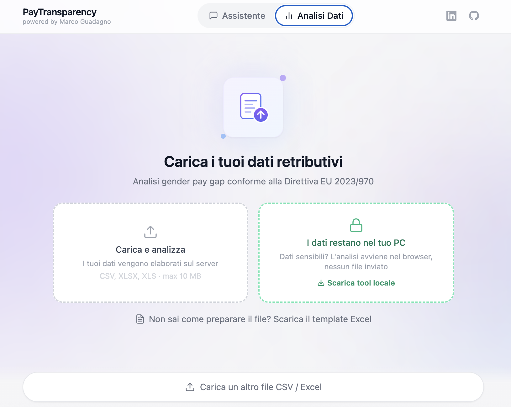

# Pay Transparency Tool

[](https://python.org)
[](LICENSE)
[](https://fastapi.tiangolo.com)
[](https://pypi.org/project/datapizza-ai/)
[](https://groq.com)

Strumento gratuito e open source per la **compliance alla Direttiva Europea 2023/970** sulla trasparenza retributiva. Pensato per HR Manager, consulenti del lavoro e aziende italiane che devono analizzare il gender pay gap e comprendere i propri obblighi normativi.

**[Prova il tool online](https://pay-transparency.marcog-ai4hr.cloud/)**

---

## Screenshot

| Assistente AI | Analisi Dati |
|:---:|:---:|
|  |  |

---

## Cosa fa

Il tool offre tre funzionalità integrate:

**Assistente AI sulla Direttiva** — Un chatbot che risponde alle tue domande sulla normativa EU 2023/970, basandosi sul testo ufficiale della Direttiva (italiano e inglese). Non inventa: ogni risposta è ancorata ai documenti originali.

**Analisi del Gender Pay Gap** — Carica un file CSV o Excel con i dati retributivi dei tuoi dipendenti e ottieni in pochi secondi: gap medio e mediano, gap per categoria (dipartimento + livello), distribuzione per quartili, analisi bonus, e verifica di conformità con la soglia EU del 5%.

**Tool Locale Offline** — Un file HTML standalone che fa la stessa analisi del pay gap interamente nel tuo browser. Nessun dato lascia il tuo computer. Perfetto per aziende con policy restrittive sui dati.

---

## Per chi usa il tool (HR)

### Online

Vai su **[pay-transparency.marcog-ai4hr.cloud](https://pay-transparency.marcog-ai4hr.cloud/)** e inizia subito — non serve registrazione.

- Tab **Assistente**: scrivi la tua domanda sulla Direttiva EU
- Tab **Analisi Dati**: carica il tuo file CSV/Excel per l'analisi del pay gap

### Offline (Tool Locale)

1. Scarica il file [`local-tool.html`](static/local-tool.html) da questo repository
2. Apri il file nel tuo browser (doppio click)
3. Carica il tuo CSV — i risultati appaiono subito, senza connessione internet

### Documentazione

- **[Guida Utente](docs/guida-utente.md)** — Come usare il tool passo dopo passo
- **[Formato dei Dati](docs/formato-dati.md)** — Come preparare il file CSV/Excel
- **[Domande Frequenti](docs/faq.md)** — Risposte alle domande più comuni

---

## Per chi sviluppa

### Quick Start

```bash
git clone https://github.com/marcoguad-HR/pay-transparency-tool.git
cd pay-transparency-tool

cp config.yaml.example config.yaml   # aggiungi la tua GROQ_API_KEY
cp .env.example .env                 # aggiungi: GROQ_API_KEY=gsk_...

bash setup.sh                        # crea venv, installa dipendenze, costruisce vector DB
```

```bash
make web     # Avvia l'interfaccia web su localhost:8000
make cli     # Avvia la CLI agent interattiva
make test    # Esegui i test
```

### Documentazione tecnica

- **[Guida Tecnica](docs/guida-tecnica.md)** — Architettura, installazione, API, configurazione
- **[Come Contribuire](CONTRIBUTING.md)** — Linee guida per contribuire al progetto
- **[Changelog](CHANGELOG.md)** — Storico delle versioni

---

## Struttura del progetto

```
pay-transparency-tool/
├── app.py                  # Entry point web (FastAPI)
├── main.py                 # Entry point CLI
├── src/
│   ├── rag/                # Pipeline RAG (ingestion, retrieval, generation)
│   ├── analysis/           # Analisi pay gap (data_loader, gap_calculator, report)
│   ├── agent/              # Router intelligente query → RAG o analisi
│   ├── web/api/            # Endpoint REST (chat, upload, health)
│   ├── cli/                # Interfaccia a riga di comando
│   └── utils/              # Config, logging, rate limiter, analytics
├── templates/              # Template Jinja2 (HTMX)
├── static/                 # File statici + tool locale
├── data/
│   ├── documents/          # Direttiva EU (PDF IT/EN) + guide markdown
│   ├── demo/               # Dataset demo (500 dipendenti fittizi)
│   └── vectordb/           # Database vettoriale Qdrant (generato)
├── tests/                  # Test unitari e di integrazione
├── scripts/                # Script di sviluppo e deploy
└── docs/                   # Documentazione
```

## Stack tecnologico

| Componente | Tecnologia |
|------------|-----------|
| Backend | FastAPI + Jinja2 + HTMX |
| AI Framework | [datapizza-ai](https://github.com/datapizza-labs/datapizza-ai) — agent, RAG pipeline, document parsing |
| LLM | Groq API (Llama 3.3-70b-versatile) |
| Embeddings | FastEmbed (MiniLM-L6-v2, 384 dim) |
| Vector DB | Qdrant (locale, in-process) |
| Retrieval | Ibrido: BM25 + ricerca vettoriale |
| Analisi dati | pandas + openpyxl |
| Frontend | Tailwind CSS + HTMX (no React/Vue) |
| Tool locale | JavaScript puro (PapaParse + Tailwind) |

## API

| Metodo | Endpoint | Descrizione |
|--------|----------|-------------|
| `POST` | `/api/chat` | Chat con assistente AI (form-encoded → HTML) |
| `POST` | `/api/upload` | Upload file CSV/Excel per analisi pay gap |
| `GET` | `/api/health` | Health check del sistema (JSON) |

---

## Licenza

[MIT](LICENSE) — Marco Guadagno, 2026

## Contribuire

Le contribuzioni sono benvenute! Leggi le [linee guida per contribuire](CONTRIBUTING.md).

## Link utili

- [Tool online](https://pay-transparency.marcog-ai4hr.cloud/)
- [Direttiva EU 2023/970](https://eur-lex.europa.eu/eli/dir/2023/970/oj)
- [Guida Utente](docs/guida-utente.md)
- [Guida Tecnica](docs/guida-tecnica.md)
- [Domande Frequenti](docs/faq.md)
